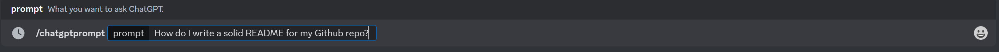
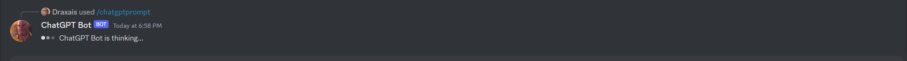
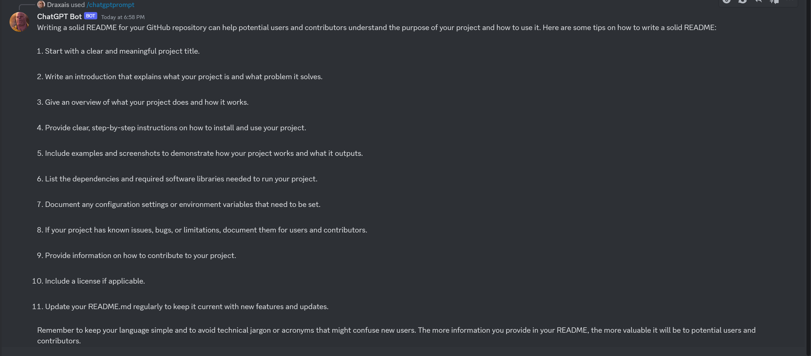
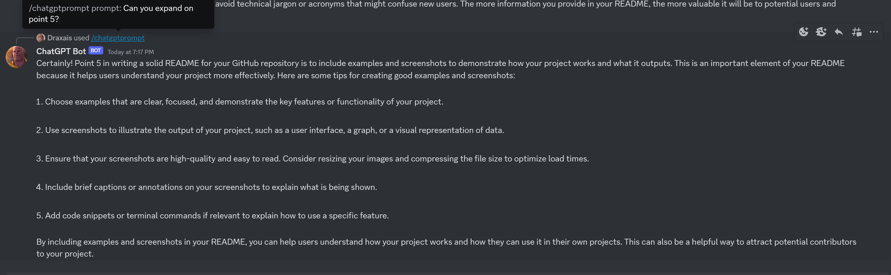

# Serverless ChatGPT Discord Bot

## Overview:
This purpose of this project was to integrate the incredibly powerful OpenAI API with the popular community platform Discord to provide ChatGPT-like functionality from within the platform. The bot can respond to any prompt and has the ability to recall previously sent messages (a feature not included in the OpenAI API natively).

I decided to make this bot serverless due to the event based nature of Discord slash commands; when using Discord slash commands, an event is sent to wherever your bot is running continously (like a service on a server, or locally in a terminal) or, optionally, an interaction endpoint. This interaction endpoint is a URL you supply that will receive events from Discord when your slash command is invoked. 

The interaction sent by discord to the interaction endpoint is an HTTP POST request which led me to leverage AWS API Gateway and AWS Lambda for processing the interactions. Leveraging these service allows me to minimize costs while ensuring maximum uptime.

### Technologies used:
- The code for this bot is written entirely in Python.
- AWS API Gateway, AWS Lambda, and AWS DynamoDB along with other complimentary services (eg. IAM).
- Terraform for deploying/managing the infrastructure.
- Azure DevOps pipeline for CI/CD.

### Examples:
#### Prompt:

#### Bot thinking:

#### Response:

#### Reference to message history:

